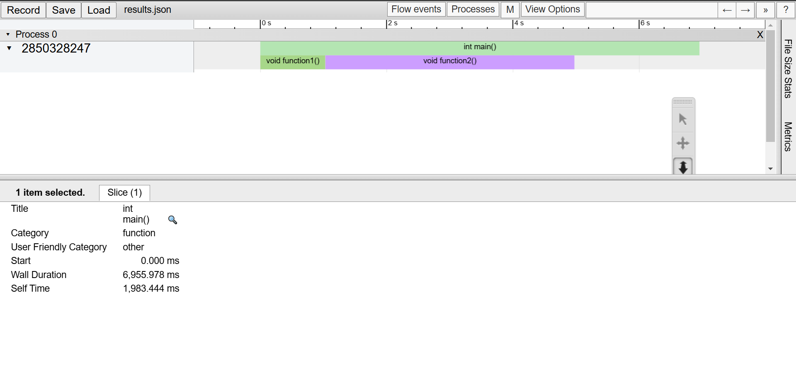

# visual benchmarking

before diving into visual benchmarking click [here]() to learn about benchmarking

who does not like seing data in form of line where the tridisional result of benchmarking is quite boring so lets make it intreating
by using visual benchmarking
we can do visual benchmarking using chrome who thought we are going to use chrome to do visual benchmarking of cpp code
we are going to use `chrome://tracing` tool which is already preinstalled on the chrome

chrome://tracing is a powerful tool built into Chrome (and other Chromium-based browsers) for recording and visualizing performance
data, often used for debugging and optimizing web applications or the browser itself. It's commonly used by developers to analyze
how well a web page or app performs, especially in terms of JavaScript execution, rendering, and event handling.


---

so what does it do is take an json file
lets talkabout json file

A JSON (JavaScript Object Notation) file is a lightweight data interchange format that is easy for humans to read and write
and easy for machines to parse and generate. It is commonly used to store and transfer structured data between a server and a
client in web applications, and across various programming languages and platforms.

## Structure of a JSON File

A JSON file consists of two main components:

- Objects: Collections of key-value pairs enclosed in curly braces {}.
- Arrays: Ordered lists of values, enclosed in square brackets [].

```json
{
  "name": "John Doe",
  "age": 30,
  "isEmployed": true,
  "address": {
    "street": "123 Main St",
    "city": "New York",
    "state": "NY"
  },
  "phoneNumbers": [
    {
      "type": "home",
      "number": "212-555-1234"
    },
    {
      "type": "work",
      "number": "646-555-5678"
    }
  ]
}
```

so what does chrome://tracing do is take an json file the json file must include the following attributes to do benchmarking for cpp code

- `"cat" (Category)`: This specifies the category of the event.

- `"dur" (Duration)`:This represents the duration of the event in microseconds.

- `"name" (Event Name)`: This specifies the name of the event in simple words the name of the function

- `"ph" (Phase)`:The phase represents the type of event.
  phases can be

  - "X" indicates a complete event that has both a start and end time.
  - "B" (Begin Event)
  - "E" (End Event)
  - "I" (Instant Event)

- `"pid" (Process ID)`:"pid":0
  This is the process ID associated with the event. In this case, pid is set to 0, which might mean it's a simplified trace or
  there is only one process being profiled. If profiling multiple processes, this would be used to distinguish between them.

- "tid" (Thread ID):This is the thread ID associated with the event. Since multiple threads can be running within a process,
  the ThreadID is used to track which thread executed the event. This is useful for understanding performance in
  multithreaded applications.

-"ts" (Timestamp):
The timestamp indicates the start time of the event in microseconds, measured from some reference point (usually the start of
the profiling session). This is essential for visualizing the timing of the event in relation to other events, enabling
accurate profiling.

```json
{
  "cat": "function",
  "dur": 200,
  "name": "myFunction",
  "ph": "X",
  "pid": 0,
  "tid": 1,
  "ts": 1000
}
```

what if there is another funtion so then we will have to create another object to store that functions data

```json
{
    "cat": "function",
    "dur": 200,
    "name": "myFunction",
    "ph": "X",
    "pid": 0,
    "tid": 1,
    "ts": 1000
},
{
    "cat": "function",
    "dur": 200,
    "name": "myFunction1",
    "ph": "X",
    "pid": 0,
    "tid": 1,
    "ts": 1000
}
```

now what does chrome://tracing does is take an json file which has an object which contains the array of objects where these objcts
contain the data of that specific funtion

you can also provide additional info(optional) like

```json
{
  "otherdata": {},
  "traceEvents": {
    "cat": "function",
    "dur": 200,
    "name": "myFunction",
    "ph": "X",
    "pid": 0,
    "tid": 1,
    "ts": 1000
  }
}
```

now lets talk about the code which will do the visual benchmarking
lets write an header file which includes the code which creates an json file to do visual benchmarking

# clasess/structs

```cpp
struct ProfileResult      //this is an struct which stores the event(funtion) information
{
    std::string Name;
    long long Start, End;
    uint32_t ThreadID;
};
```

```cpp
struct InstrumentationSession
{
    std::string Name;           //this stores the name of the session which is being examined
};
```

```cpp
class Instrumentor    //this is an singliton class whcih simply creates an json file
{
private:
    InstrumentationSession* m_CurrentSession;
    std::ofstream m_OutputStream;
    int m_ProfileCount;               //how many profiles(functions) are being examined
    Instrumentor()
        : m_CurrentSession(nullptr), m_ProfileCount(0)
    {
    }
public:

    Instrumentor(const Instrumentor&) = delete;
    Instrumentor& operator=(const Instrumentor&) = delete;

    void BeginSession(const std::string& name, const std::string& filepath = "results.json")
    {                                                    //this member funtion just begins an session and creates an json file
        m_OutputStream.open(filepath);
        WriteHeader();
        m_CurrentSession = new InstrumentationSession{ name };
    }

    void EndSession()      //this member function just end the session that is opened
    {
        WriteFooter();
        m_OutputStream.close();

        delete m_CurrentSession;
        m_CurrentSession = nullptr;
        m_ProfileCount = 0;
    }

    void WriteProfile(const ProfileResult& result)   //this member function write all the data in json file
    {
        if (m_ProfileCount++ > 0)    //if we are benchmarking more than one functions this will be executed and will print ,
            m_OutputStream << ",";     //in the json file and then write the next functions data(object)

        std::string name = result.Name;
        std::replace(name.begin(), name.end(), '"', '\'');    //if the name contains any " this will make an error so we are replacing it
                                                               //with sigle quote '
        m_OutputStream << "{";
        m_OutputStream << "\"cat\":\"function\",";
        m_OutputStream << "\"dur\":" << (result.End - result.Start) << ',';
        m_OutputStream << "\"name\":\"" << name << "\",";
        m_OutputStream << "\"ph\":\"X\",";
        m_OutputStream << "\"pid\":0,";
        m_OutputStream << "\"tid\":" << result.ThreadID << ",";
        m_OutputStream << "\"ts\":" << result.Start;
        m_OutputStream << "}";

        m_OutputStream.flush();

        //what is flush()
        /*
        With Buffering: Normally, when you write data to an output stream (like std::cout or a file), the data is first placed in
        a buffer. This buffer helps improve performance by reducing the number of actual I/O operations (which are relatively slow).

        With flush(): Calling flush() forces the data in the buffer to be sent to its destination immediately, but the buffer
        remains in place and can still collect future output.


        When to Use flush()
        Real-time Output: If you're writing to a console or log file and you want to ensure that messages are immediately
         visible or recorded (e.g., in debugging scenarios).
        Critical Points in Code: If your program may crash or exit unexpectedly, using flush() can help ensure that critical
        output is saved before the program terminates.
        */
    }

    void WriteHeader()    //this member function jsut creates an header for the json file so it could be valid for benchmarking
    {
        m_OutputStream << "{\"otherData\": {},\"traceEvents\":[";
        m_OutputStream.flush();
    }

    void WriteFooter()   //this member function just creates an footer for json file after all the data is printed in the json file
    {
        m_OutputStream << "]}";
        m_OutputStream.flush();
    }

    static Instrumentor& Get()     //function that return static object as this class is singliton class
    {
        static Instrumentor instance;
        return instance;
    }
};

```

```cpp
class InstrumentationTimer         //class that uses chrono to find benchmarking
{
public:
    InstrumentationTimer(const char* name)
        : m_Name(name), m_Stopped(false)
    {
        m_StartTimepoint = std::chrono::high_resolution_clock::now();
    }

    ~InstrumentationTimer()
    {
        if (!m_Stopped)
            Stop();
    }

    void Stop()
    {
        auto endTimepoint = std::chrono::high_resolution_clock::now();

        long long start = std::chrono::time_point_cast<std::chrono::microseconds>(m_StartTimepoint).time_since_epoch().count();
        long long end = std::chrono::time_point_cast<std::chrono::microseconds>(endTimepoint).time_since_epoch().count();

        uint32_t threadID = std::hash<std::thread::id>{}(std::this_thread::get_id());        //to get the id of thread
        Instrumentor::Get().WriteProfile({ m_Name, start, end, threadID });               //passing profileresult obj using agregate initilization

        m_Stopped = true;
    }
private:
    const char* m_Name;
    std::chrono::time_point<std::chrono::high_resolution_clock> m_StartTimepoint;
    bool m_Stopped;
};
```

# main/functions

```cpp

void func1() {
    InstrumentationTimer timer("func1");      //here we initiate the timer

    std::this_thread::sleep_for(std::chrono::milliseconds(100));

    std::cout << "Performing task..." << std::endl;
}
void func2() {
    InstrumentationTimer timer("func2");      //here we initiate the timer

    std::this_thread::sleep_for(std::chrono::milliseconds(100));

    std::cout << "Performing task..." << std::endl;
}
int main() {
    Instrumentor::Get().BeginSession("profile1");     //here we start the session

    func1();
    func2();

    Instrumentor::Get().EndSession();    //here we end the session

    return 0;
}
```

# problem #1

this code will then create an json then upload that json file to chrome://tracing which will give you visual benchmarking
but what if we donot want to do benchmarking you may be thinking that i will not include the header file but then you would have
to remove all the lines from every function

we can overcome this problem by using preprocess statements
another problem that we have to call each function name when calling the the timer

# solutions

```cpp
#define profiling 1     //if you want bencmarking set it to 1
#if profiling
#define profile_scope(name) InstrumentationTimer timer##__LINE__(name)     //the ## is used to combine two words togather where __line__
                                                                          //is used to represent the line so for safty we are using this
//#define profile_Function()  profile_scope(__FUNCTION__)     //the __FUNCTION__ macro is the gives the name of function but what if we are
                                                        //overloading an function we will not be able to distinguish between the funtions
                                                        //so we should use __FUNCSIG__ which gives the function signature
                                                        //then you will be able to distinguish between them
#define profile_Function()  profile_scope(__FUNCSIG__)
#define begin_session(session_name) Instrumentor::Get().BeginSession(session_name)
#define end_session() Instrumentor::Get().EndSession()
#else
#define profile_scope(name)
#define profile_Function()
begin_session(session_name)
end_session()
#endif


// we can also work with threads which can beautifully shown in the chrome://tracing
//so chrome://tracing is not only used to have benchmaing of the code it also gives you an ovrview of the code how it works

```

# problem #2

the secound problem we are facing is that this code is only supported by visual studio as in

```cpp
#define profile_Function()  profile_scope(__FUNCSIG__)
```

`__FUNCSIG__` is \_MSC_VER (visual studio) only suppoted so this code will only run on vsstudio so lets solve it

# solution

```cpp
#define profiling 1

#if profiling
// Check for Visual Studio compiler
#define profile_scope(name) InstrumentationTimer timer##__LINE__(name)

#ifdef _MSC_VER
#define profile_Function() profile_scope(__FUNCSIG__)

// Check for GCC or Clang compiler
#elif defined(__GNUC__) || defined(__clang__)
#define profile_Function() profile_scope(__PRETTY_FUNCTION__)

// Add additional compiler checks if needed
#else
#error "Unsupported compiler"
#endif

// Conditional profiling session management (for all compilers)
#define begin_session(session_name) Instrumentor::Get().BeginSession(session_name)
#define end_session() Instrumentor::Get().EndSession()

#else
#define profile_scope(name)
#define profile_Function()

// If profiling is off, just begin and end session
#define begin_session(session_name)
#define end_session()
#endif
```

only this line is differnt

```cpp
#define profile_Function() profile_scope(__PRETTY_FUNCTION__)
```

**PRETTY_FUNCTION** is a compiler-specific predefined macro that provides a string representation of the function signature where it is used, including the function name, parameter types, and other relevant information.

Platform and Compiler Support:

- GCC/Clang: **PRETTY_FUNCTION** is supported.
- MSVC: MSVC uses **FUNCSIG** for similar functionality. It does not have **PRETTY_FUNCTION**.
- Other compilers: If you are using a different compiler, **PRETTY_FUNCTION** might not be available, but most modern compilers provide some form of function signature information, like **FUNC** or **FUNC_SIG**.

# problem #3

The last problem faced is `time scope` as the core backend of this benchmarking depends on the life time scope of the ` profile_Function();` function when i use it like

```cpp
int main()
{
  begin_session("Profile");

    profile_Function();

    function1();
    function2();

    for (volatile int i = 0; i < 1000000000; ++i)
    {
    }

  end_session();

  return 0;
}
```

so what happend is the code follows the following order

```bash
Session started: Profile
Timer started for: int main()
Timer started for: void function1()
Profile written for: void function1()
Timer stopped for: void function1()
Timer started for: void function2()
Profile written for: void function2()
Timer stopped for: void function2()
Session ended
Profile written for: int main()
Timer stopped for: int main()
```

you can clearlly see that the session ends before the main function's profile is wriiten
this is because the session ends before

and if we see in the `result.json` only the profiles of the two fuction will be wriiten but not the profile of the main function

so we need to make sure that the session does not end before the profiles

so what we will do is that we will make the profile die before the session

```cpp
int main()
{
  begin_session("Profile");
  {

    profile_Function();

    function1();
    function2();

    for (volatile int i = 0; i < 1000000000; ++i)
    {
    }
  }

  end_session();

  return 0;
}
```

so now we will get

```bash
Session started: Profile
Timer started for: int main()
Timer started for: void function1()
Profile written for: void function1()
Timer stopped for: void function1()
Timer started for: void function2()
Profile written for: void function2()
Timer stopped for: void function2()
Profile written for: int main()
Timer stopped for: int main()
Session ended
```

now you can see that the session ends at the end 

and the json file will also contain the profile of main written

# final result




